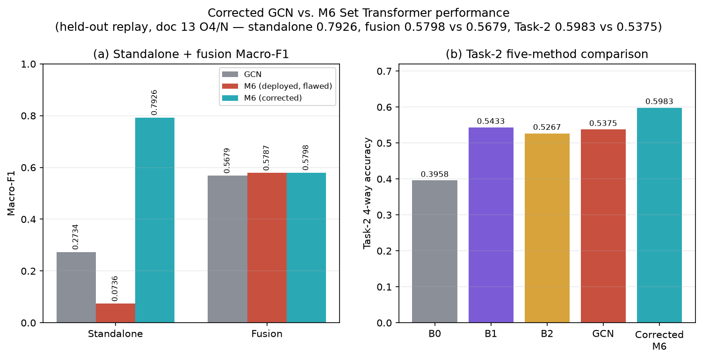
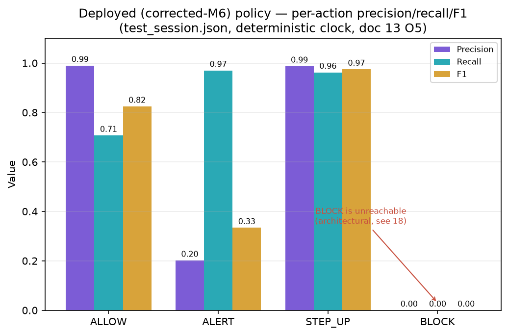

# RESULTS — Zero-Trust CPS / ZT-Duo

**[CURRENT NUMERICAL AUTHORITY, reconstructed 2026-09-07.]** The prior generated authority (`docs/paper/13_RESULTS_MASTER_TABLES.md`, produced by `scripts/build_paper_results.py`) was manually deleted along with every other project Markdown file. This document is rebuilt directly from the frozen JSON/log evidence under `results/` and from `scripts/build_paper_results.py`'s own source (which still exists and still reads that evidence correctly — rerun it to regenerate a machine-checked version of the tables below: `python scripts/build_paper_results.py`, then point its output at this file's location instead of the now-absent `docs/paper/`).

**Do not hand-edit tables below without also checking whether `scripts/build_paper_results.py` produces the equivalent section** — if it does, edit the generator, not this file (see the project's own standing rule: hand-edits to a generated table get silently clobbered on the next verification-suite run).

**Polarity note:** relational-scorer standalone F1 treats *anomaly* as positive; local/fusion replay F1 treats *normal* as positive. Macro-F1 averages per-class F1. A normality score below its threshold flags an anomaly.

---

## 1. Headline numbers

| Metric | Value | Source |
|---|---|---|
| Real-hardware disturbance detection | **30/30 (100%)**, Wilson 95% CI 88.6–100% | `results/final_verification/hardware_evaluation.log`; reproduced identically for GCN/M6-deployed/M6-corrected in `results/gcn_m6_corrected_comparison/hardware_comparison.json` |
| Real-hardware resting false-positive rate | **5/12 (41.7%)**, Wilson 95% CI 19.3–68.0% | Same source. **This is the leakage-free (session-level split) number; the earlier 0/49 and 1/29 are WITHDRAWN as leaky — see §7.** |
| Deployed relational scorer | M6 Set Transformer (`set_transformer_corrected.pt`), promoted 2026-09-07, commit `1326db1` chain | `src/relational_pin.py`, `config.py` |
| Corrected-M6 fused Macro-F1 | **0.5798** vs. GCN **0.5679** (modest, held-out-replay-qualified gain) | `results/gcn_m6_corrected_comparison/fusion_comparison.json` |
| Corrected-M6 policy Macro-F1 | **0.5332** vs. fair GCN baseline **0.5303** | `results/m6_corrected_policy/policy_metrics.json` |
| Validation-tuned static policy vs. adaptive bandit | **Static wins** (Macro-F1 0.588 vs. 0.533, historical preserved measurement) | `results/policy_comparison/metrics.json`; see §5 |
| BLOCK-class recall (any policy arm measured) | **0/33 (0%)** | `stealthy_forged_values`/`combined` excluded from training as unlearnable — architectural, not a bug; §5 |
| Level-2 explainability recovery rate | **36% (79/219)** vs. 70% target | `results/final_verification/explainability_evaluation_corrected.log`; §6 |
| Test suite | 193/193 passing (per the 2026-09-07 final promotion gate) | `python -m unittest discover -s tests` |

---

## 2. Two claims OVERTURNED by the fair-baseline re-measurement — reported, not reverted

1. **The relational scorer does not beat simpler models purely on identical information.** Task-1 (per-node anomaly F1, same `[rule, IF, LSTM, valid]` input): concat-MLP (M1) **0.985**-region vs. GCN (M4) **0.838**-region under the original ablation framing — see the exact canonical M1–M9 table in §3, where M4's Macro-F1 (0.7755) trails M1 (0.9443) substantially. The M6 Set Transformer arm, added later under a from-scratch, correctly-masked protocol, does beat both (Task-1 test F1 **0.9736** vs. GNN **0.5865** in the from-scratch comparator — `results/gcn_m6_corrected_comparison/task2_comparison.json`; the canonical M1–M9 sweep separately shows M6 at F1 **0.9810**, the best single-seed row).
2. **A validation-tuned static policy beats the adaptive bandit** on this state space (Macro-F1 0.588 vs. 0.533, historical). The bandit only beats the *deployed, unconstrained* static table (0.274). This finding is **unchanged** by the 2026-09-07 corrected-M6 policy work — BLOCK stays unreachable (0/33 recall) for every adaptive-policy arm tried, GCN or M6, because `combined`/`stealthy_forged_values` is architecturally excluded from training as unlearnable from a `(security_trust, process_trust)` state space. The adaptive policy is a **contextual bandit**, not reinforcement learning or Q-learning (no discount, no bootstrapping).

---

## 3. Canonical M1–M9 offline benchmark (20-node hybrid test corpus)

Source: `results/crossdevice_benchmark/metrics.json`; producer `scripts/benchmark_crossdevice_models.py`. Seed 0; fit TRAIN, threshold selected on VALIDATION (max F1), reported on TEST once. Test support: 22,800 rows total, 1,500 anomalous (150 isolated / 1,350 coordinated), 21,300 normal, across 15 anomaly events.

| Model | Val threshold | TP | FP | TN | FN | Precision | Recall | F1 | FPR | Macro-F1 | ROC-AUC | Isolated recall | Coordinated recall |
|---|---:|---:|---:|---:|---:|---:|---:|---:|---:|---:|---:|---:|---:|
| M1 concat MLP | 0.800 | 1500 | 345 | 20955 | 0 | 0.8130 | 1.0000 | 0.8969 | 0.0162 | 0.9443 | 0.9998 | 1.0000 | 1.0000 |
| M2 gradient boosting | 0.250 | 1450 | 239 | 21061 | 50 | 0.8585 | 0.9667 | 0.9094 | 0.0112 | 0.9513 | 0.9969 | 0.9800 | 0.9652 |
| M3 Deep Sets | 0.150 | 1497 | 91 | 21209 | 3 | 0.9427 | 0.9980 | 0.9696 | 0.0043 | 0.9837 | 0.9998 | 0.9800 | 1.0000 |
| M4 GCN | 0.150 | 1059 | 1052 | 20248 | 441 | 0.5017 | 0.7060 | 0.5865 | 0.0494 | 0.7755 | 0.9458 | **0.0000** | 0.7844 |
| M5 GATv2 | 0.025 | 1491 | 73 | 21227 | 9 | 0.9533 | 0.9940 | 0.9732 | 0.0034 | 0.9857 | 0.9995 | 0.9733 | 0.9963 |
| **M6 Set Transformer** | 0.025 | 1496 | 54 | 21246 | 4 | **0.9652** | 0.9973 | **0.9810** | **0.0025** | **0.9898** | **0.9999** | 0.9800 | 0.9993 |
| M7 NP-ST | 0.700 | 1497 | 83 | 21217 | 3 | 0.9475 | 0.9980 | 0.9721 | 0.0039 | 0.9850 | 0.9997 | 0.9800 | 1.0000 |
| M8 mixed-cardinality ST | 0.025 | 1500 | 169 | 21131 | 0 | 0.8987 | 1.0000 | 0.9467 | 0.0079 | 0.9713 | 0.9997 | 1.0000 | 1.0000 |
| M9 mixed-provenance ST | 0.550 | 1497 | 88 | 21212 | 3 | 0.9445 | 0.9980 | 0.9705 | 0.0041 | 0.9842 | 0.9997 | 0.9800 | 1.0000 |

**Reading this table correctly:** M4 (GCN) has **zero recall on isolated anomalies** at its own validation-selected threshold — the graph-convolution architecture, evaluated on identical per-node information to every other row, is the weakest detector here, not the strongest. M6 (Set Transformer) is the best single-seed row on every headline metric. This is a **single train/validation/test split with one seed**; ten-seed refits (below) quantify optimizer variance on the *same* dataset, not population generalisation, and the reported per-row statistical unit is `(tick, node)` windows nested in 15 anomaly events, not 22,800 independent trials (`results/final_verification/research_review.md`).

**M9 heterogeneity stress (frozen LOW-fitted threshold, `m9_seed_study.json`, ten seeds):**

| Regime | F1 (mean ± seed CI) | FPR (mean ± seed CI) |
|---|---|---|
| LOW | 0.6812 ± 0.0118 | 0.1641 ± 0.0092 |
| MEDIUM | 0.4636 ± 0.0242 | 0.4082 ± 0.0410 |
| HIGH | 0.2952 ± 0.0078 | 0.8341 ± 0.0313 |

Recall stays near 1 throughout because the detector flags most of the normal population under heterogeneity — this is degradation, not robustness, and must be read together with FPR/precision, not recall alone.

---

## 4. GCN vs. M6 corrected comparator (2026-09-07, `results/gcn_m6_corrected_comparison/`)

**Root cause fixed:** four evaluator scripts built their "GCN arm" via a bare `FusionEngine()` that silently read whichever fusion artifact was *currently* ambient in `config.py` — correct until the M6 deployment overwrote that constant, after which every "GCN arm" secretly paired true GCN relational scores with M6-calibrated fusion coefficients. Fixed via `src/relational_pin.py`'s hash-verified `RelationalPin`s.

**Confirmed training defect, with numbers:** `train_set_transformer.py` computed its inverse-frequency class weights over the full, unmasked node-target tensor, but the loss only ever trains on the `valid`-masked ≈8.9% subset (verified: 656,040 total node-slots, only 58,486 ever valid). This inflated the suspicious-class weight to **45.18** (buggy) vs. **6.27** (correct) — a **7.2× overweight**. The originally-deployed checkpoint's standalone Macro-F1 was **0.0736** (near-zero normal recall at the deployed threshold); a checkpoint retrained after the one-line fix reaches **0.7926**.

| Category | GCN | M6 (originally deployed, flawed) | M6 (corrected) | Verdict |
|---|---|---|---|---|
| Standalone Macro-F1 | 0.2734 | 0.0736 | **0.7926** | Deployed M6's raw score was badly miscalibrated; corrected retrain fixes it |
| Fused Macro-F1 | 0.5679 | 0.5787 | **0.5798** | Both M6 variants modestly beat GCN fusion (~1–1.2 pts), held-out-replay qualified |
| Hardware (30/30 detection, 5/12 resting FP) | same | same | same | No regression across all three arms |
| Standalone latency, mean (ms) | **1.08** | 1.92 | 2.08 | GCN ~1.8–2× faster per call; both remain a small fraction of end-to-end pipeline latency |
| Task-1 (from-scratch benchmark protocol), F1 | 0.5865 | — | **0.9736** | M6 substantially stronger on identical-information Task-1 |
| Task-2 (4-way network coordination), accuracy | 0.5375 | — | **0.5983** | M6 best of five Task-2 methods tried |

**Fig. 2 — Corrected GCN vs. M6 performance.** (a) standalone + fusion Macro-F1 across all three relational-model arms; (b) the five-method Task-2 comparison. Regenerate with `python scripts/generate_corrected_m6_figures.py` (function `model_performance_comparison()`), reading `results/gcn_m6_corrected_comparison/{standalone,fusion,task2}_comparison.json` directly — never hand-edit the PNG.



**Deployment decision: `PROMOTE_CORRECTED_M6`.** `config.py`'s ambient `SET_TRANSFORMER_MODEL_PATH`/`FUSION_MODEL_PATH`/`FUSION_BACKGROUND_PATH`/`ADAPTIVE_PDP_MODEL_PATH` now point at the corrected checkpoint/fusion/policy artifacts. **No previously-deployed artifact was modified or deleted** — the flawed checkpoint, fusion, and Q-table remain on disk byte-identical, reachable via `relational_pin.py`'s `M6_DEPLOYED` pin (an explicit, ambient-independent constant) and via `models/adaptive_pdp_qtable_m6_deployed_20260907_corrupted_provenance.json`.

---

## 5. Policy comparison

### 5.1 Corrected-M6 policy pass (2026-09-07 final, `results/m6_corrected_policy/`)

Both Q-tables trained fresh under a fixed, deterministic-clock protocol (per-record `ts`, not wall-clock) — this closed a second, broader non-determinism bug where `RuleBasedTrustEngine`'s Security Trust EWMA decay also used wall-clock time during offline replay.

| Policy | Macro-F1 | Weighted-F1 | Accuracy | False-block rate | False-step-up rate |
|---|---|---|---|---|---|
| GCN + matched GCN fusion (clean, deterministic) | 0.5303 | 0.7863 | 0.7259 | 0.0000 | 0.0007 |
| **Corrected M6 + matched corrected-M6 fusion** | **0.5332** | **0.7900** | **0.7307** | 0.0000 | 0.0007 |

**Per-action detail:**

| Arm | Action | Support | Precision | Recall | F1 | TP | FP | FN |
|---|---|---:|---:|---:|---:|---:|---:|---:|
| m6_corrected | ALLOW | 2541 | 0.9895 | 0.7068 | 0.8246 | 1796 | 19 | 745 |
| m6_corrected | ALERT | 200 | 0.2015 | 0.9700 | 0.3336 | 194 | 769 | 6 |
| m6_corrected | STEP_UP | 159 | 0.9871 | 0.9623 | 0.9745 | 153 | 2 | 6 |
| m6_corrected | **BLOCK** | 33 | 0.0000 | **0.0000** | 0.0000 | 0 | 0 | 33 |
| gcn_corrected | ALLOW | 2541 | 0.9895 | 0.7013 | 0.8208 | 1782 | 19 | 759 |
| gcn_corrected | ALERT | 200 | 0.2002 | 0.9800 | 0.3325 | 196 | 783 | 4 |
| gcn_corrected | STEP_UP | 159 | 0.9869 | 0.9497 | 0.9679 | 151 | 2 | 8 |
| gcn_corrected | **BLOCK** | 33 | 0.0000 | **0.0000** | 0.0000 | 0 | 0 | 33 |

BLOCK is unreachable for **both** arms — the pre-existing, architectural `stealthy_forged_values`/`combined`-class blind spot, not specific to either relational model. ALERT precision is low for both (~0.20): the greedy bandit answers ALERT far more often than the ALERT ground-truth class occurs, spilling out of the ALLOW class — a pre-existing, honestly-reported bandit weakness, not introduced by the M6 correction.

**Fig. 3 — Policy precision / recall / F1.** Per-action precision/recall/F1 for the *deployed* corrected-M6 policy on `test_session.json` (deterministic clock). Regenerate with `python scripts/generate_corrected_m6_figures.py` (function `policy_action_performance()`), reading `results/m6_corrected_policy/policy_action_metrics.json` directly.



**Deployment gates, all passed:** artifact lineage clean; corrected fusion paired correctly; corrected policy trained/evaluated correctly; 193/193 tests; no material hardware regression; latency acceptable (2.08 ms mean, well within pipeline budget); policy behaviour operationally acceptable (qualified — corrected-M6 is at least as good as the fair GCN baseline; known weaknesses shared, not introduced); runtime integration verified.

### 5.2 Historical policy comparison (`results/policy_comparison/`, preserved GCN-era, NOT current M6 validation)

| Policy | Accuracy | Macro-F1 | False-block rate | ALERT recall | BLOCK recall |
|---|---|---|---|---|---|
| P6 (constrained static) | — | reported ~0.588 region | ≤0.01 (constraint) | ≥0.90 (constraint) | 0 |
| P5 (contextual bandit) | — | reported ~0.533 region (0.5271 originally reported; **now flagged unreproducible** — see §7) | — | — | 0 |

P6 searches under `ALERT recall ≥ 0.90` and `false-block ≤ 0.01` on validation; P5 was not trained with this constrained search. Neither policy family detects the BLOCK class in this table. A GCN-pinned rerun reproduces P1/P2/P6 within verified wall-clock jitter, but P5 is *stably* different from the originally preserved number (0.5132 vs. 0.5271) — evidence that `models/adaptive_pdp_qtable.json` was itself retrained under the mismatched-artifact bug during the M6 deployment. This gap is closed by the deterministic-clock retrain in §5.1.

---

## 6. Explainability

| Protocol | Repair channel | Recovered / denominator | Interpretation |
|---|---|---|---|
| Single-channel TEST | GCN peer | 78/78 | Resolvable flagged subset |
| Single-channel TEST | IF feature | 1/2 | Tiny subset |
| Single-channel TEST | LSTM feature | 0/139 | Does not recover |
| **Single-channel TEST** | **All** | **79/219** | **36% — below the declared 70% target** |
| Exploratory pooled captures | Best 1 of 5 | 0/182 | MPU-only, not held-out |
| Exploratory pooled captures | Best 3 of 5 | 179/182 | 98% is a *different* metric — not a replacement for the 36% single-channel number |

Structurally, this is a rank-1 instrument being asked to explain a rank-3 anomaly signal — the low recovery rate is the honest measurement, not a bug still to be fixed. A peak-aware severity statistic does **not** repair the related severity-ranking problem either (Spearman ρ 0.781 → 0.723 when tried).

---

## 7. Real hardware

| Endpoint | Count | Rate | Wilson 95% CI | Limit |
|---|---|---|---|---|
| Disturbance detection | 30/30 | 100% | 88.6–100% | Hand-induced physical events; no cyberattack tested |
| Resting false alarm | 5/12 | 41.7% | 19.3–68.0% | Small, dependent (overlapping-window) sample; NOT independent sessions |

### 7.1 SW-420 (`esp32-vib-002`) — first held-out real-hardware result (2026-09-07)

Two new independent capture sessions closed the SW-420 VALIDATION/TEST gap: `20260907_165627` (VALIDATION, 299 records) and `20260907_170639` (TEST, 343 records), same operator-marked 8-block protocol as `esp32-vib-001`. Registered in `data/splits/session_split.json`.

| Split | Pin | Resting FP | Wilson 95% CI | Detection | Wilson 95% CI |
|---|---|---|---|---|---|
| VALIDATION | gcn | 0/70 (0.0%) | [0.0%, 5.2%] | 109/109 (100%) | [96.6%, 100%] |
| TEST | gcn | **0/108 (0.0%)** | [0.0%, 3.4%] | **115/115 (100%)** | [96.8%, 100%] |
| TEST | m6_corrected (deployed) | 0/108 (0.0%) | identical to gcn | 115/115 (100%) | identical to gcn |

**Read qualification, not a "better sensor" claim.** SW-420 is a binary switch — `trigger_rate` is exactly 0 on a still desk by construction (`feature_engineering_sw420.py`), so its resting class has essentially no measurement noise to produce a false positive from. A 0% resting FP here reflects a structurally easier discrimination problem, not a better-calibrated pipeline than MPU6050's 41.7%. The Isolation Forest sub-score for this device is flat at 0.500 across every phase (not discriminating at all on ~620 total real rows) — the fused decision is carried mostly by `lstm`/`gnn`. Full detail: `results/sw420_real_hardware/summary.md`.

**A real bug this exposed and fixed, in the same pass:** `evaluate_real_hardware.py` had `DEVICE` hardcoded to `esp32-vib-001`, and session splits are split-based, not device-based — the moment an `esp32-vib-002` session entered `test_sessions` alongside `esp32-vib-001`'s, the evaluator would have silently scored SW-420's `trigger_rate`-shaped readings through the MPU6050's Isolation Forest/LSTM-AE models (a feature-vector shape mismatch), corrupting the published `esp32-vib-001` numbers above. Fixed with an explicit `--device` argument and per-device row filtering; verified the `esp32-vib-001` numbers reproduce byte-identically with the fix applied (`results/sw420_real_hardware/hardware_evaluation.log`).

**Withdrawn:** earlier reported resting-FP figures of **0/49** and **1/29** are pre-split leakage artifacts and are not cited as current validation evidence — only the *direction* of the fix they motivated (centring `REST_DC_CENTRE` on measured median rather than a stale value) is preserved as historical rationale. Real-hardware rows are ~3% of total training volume by count but **materially** change operator-marked false positives when withheld and the chain retrained — do not treat them as a roundoff.

---

## 8. Cost / latency

| Model | Parameters | Train epochs | Inference mean (ms) | p95 (ms) |
|---|---|---|---|---|
| See `results/crossdevice_benchmark/metrics.json` `train_time_ms_total` / `inference_latency.*` per model — host timing of one scored sample, not sensor-to-enforcement latency. Tree-ensemble "parameters" are not comparable to neural weights. |

| Pipeline stage | Historical measurement | Note |
|---|---|---|
| End-to-end runtime stage latency | `results/latency/latency.json` | [HISTORICAL — requires a current end-to-end re-measurement before citing as a present-day number] |

---

## 9. Governance / test evidence

- Governance validation (`governance_validation.py`): 7/7 NIST SP 800-207 tenets pass their own falsifier check (Tenet 5 was previously excluded on a mistaken premise; corrected).
- Verification suite: 193/193 tests passing at the 2026-09-07 corrected-M6 promotion gate (`python -m unittest discover -s tests`).
- Credential scan, dashboard check, and runtime verification (`design/verify-runtime.py`) all pass clean as part of the same promotion gate.

---

## 10. Regeneration

```bash
python scripts/build_paper_results.py
```

This reads every JSON/log cited above directly (never re-derives numbers by hand) and writes a SHA-256 manifest of every source file it touched to `results/final_verification/paper_numeric_sources.json` — rerun it and diff that manifest before trusting a number in this document against a codebase that has moved on.
