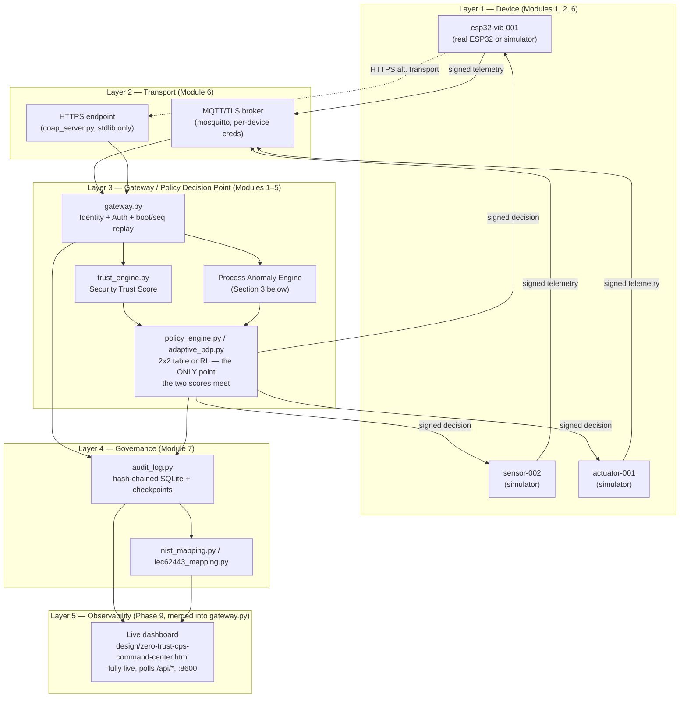
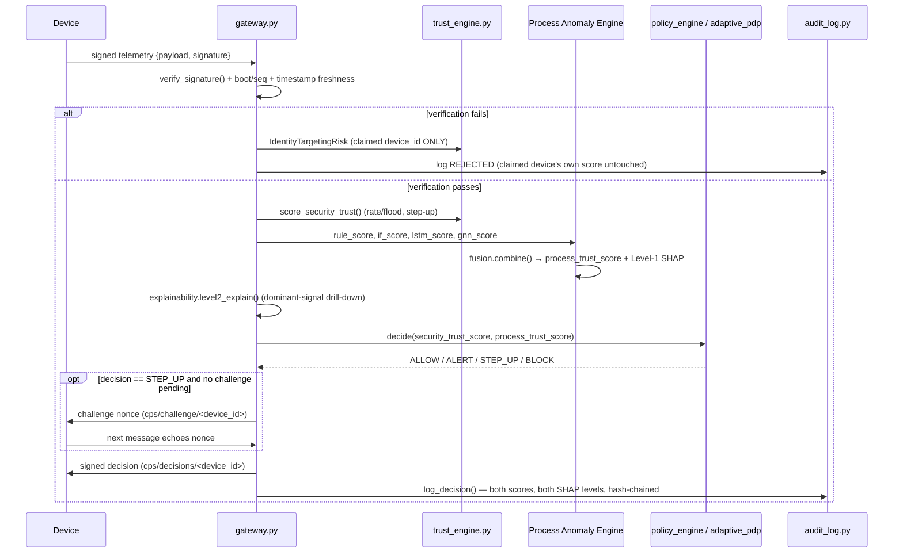
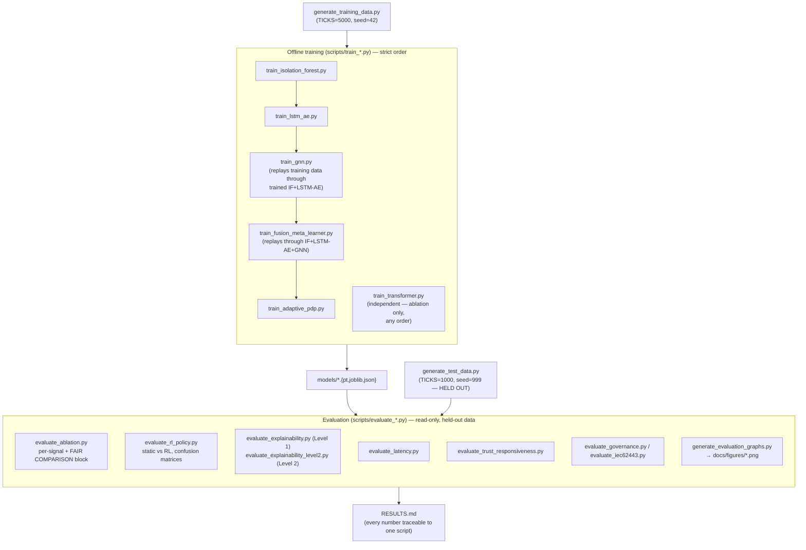
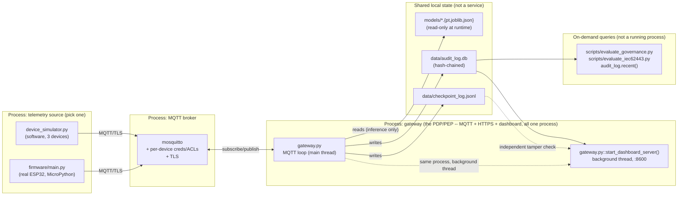
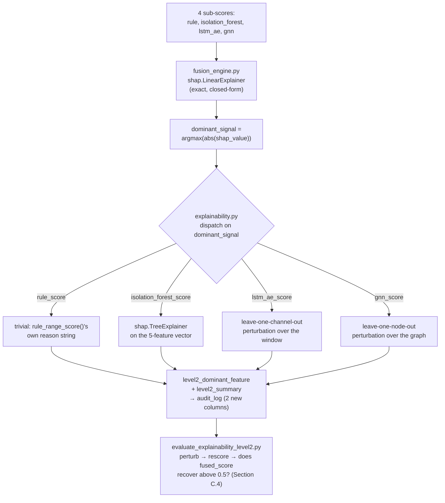

# 13 — System Architecture and Workflow

> **2026-09-05 audit update:** Distinguish as-built Rule/IF/LSTM/GCN fusion from experimental Set Transformer. Physical Device 2 (SW-420) has its first real capture, TRAIN split only — VALIDATION/TEST still pending; M9 has training at 15 slots but no saved 15-node test.
> Current evidence and limitations: RESULTS §0.13.17, then §0.13.18–§0.13.22.

A single, complete picture of how this project fits together: layered
architecture, every component's role, the live message-processing
workflow, the offline training/evaluation workflow, and the physical
process/deployment topology. Every diagram below describes the AS-BUILT
system (verified against `src/*.py` directly this session, cross-checked
against `docs/00_overview.md`'s AS-BUILT deviation list), not the
original from-scratch design. Read `docs/00_overview.md` first if you
haven't — this file assumes its deviation list as background and doesn't
repeat it.

---

## 1. Layered Architecture



**The one rule this diagram exists to make visually unmissable**: G2
(Security Trust) and G3 (Process Anomaly) are two parallel paths that
only converge at G4. Nothing upstream of G4 ever blends them into one
number — this is the architectural decision the entire "two-score
rearchitecture" (`SESSION_LOG.md` §23) exists to enforce, and every
downstream consumer (audit log, dashboard) reads both scores as separate
columns for the same reason. V1 is served by `gateway.py` itself (its
Module 9 extension section, `start_dashboard_server()`) in a background
thread, not a separate process — one script (`python gateway.py`) runs
MQTT, the HTTPS second transport, and the dashboard together
(`SESSION_LOG.md` §29/§30).

---

## 2. Module-to-File Map

| Module | Responsibility | Primary file(s) |
|---|---|---|
| 1 — Device Identity | `DEVICE_REGISTRY`, per-device secrets/credentials | `src/config.py` |
| 2 — Authentication | HMAC verify, boot/seq anti-replay, step-up challenge/response, `IdentityTargetingRisk` | `src/gateway.py`, `src/trust_engine.py` |
| 3, Section A — Security Behaviour | Rate/flood + step-up → Security Trust Score | `src/trust_engine.py::score_security_trust()` |
| 3, Section B — Process Anomaly | 5 sub-signals + fusion → Process Anomaly Score | `src/trust_engine.py::rule_range_score()`, `isolation_forest_scorer.py`, `lstm_ae_scorer.py`, `transformer_scorer.py` (ablation), `gnn_scorer.py`, `fusion_engine.py` |
| 3, Section C — Explainability | Level 1 (fusion SHAP) + Level 2 (per-signal drill-down) | `fusion_engine.py`, `src/explainability.py` |
| 4 — Continuous Verification | Per-device state store for both scores, recomputed every message | `src/trust_engine.py` |
| 5 — Access Control | Static 2x2 table, or RL bandit reading the same 2D state | `src/policy_engine.py`, `src/adaptive_pdp.py` |
| 6 — Secure Communication | MQTT/TLS, HTTPS (CoAP-shaped) | `src/device_simulator.py`, `src/coap_server.py`, `firmware/main.py` |
| 7 — Monitoring & Audit | Hash-chained log, governance tenet mapping | `src/audit_log.py`, `src/nist_mapping.py`, `src/iec62443_mapping.py` |
| 9 — Observability (extension) | Live dashboard (`design/zero-trust-cps-command-center.html`, a single fully-live page that polls the `/api/*` endpoints itself), served by `gateway.py` on a background thread, no separate script | `src/gateway.py` (Module 9 extension section), `src/audit_log.py`, `src/nist_mapping.py`, `src/iec62443_mapping.py` |

---

## 3. Process Anomaly Engine — Internal Architecture

```mermaid
flowchart LR
    R["raw accel window<br/>(32 samples @ 100Hz)"] --> FE["feature_engineering.py<br/>rms · peak · crest_factor ·<br/>kurtosis · dominant_freq"]
    FE --> S1["Rule range check<br/>(no training)"]
    FE --> S2["Isolation Forest<br/>(unsupervised ML)"]
    FE --> S3["LSTM-Autoencoder<br/>(DL, recurrent, seq_len=8)"]
    FE --> S4["Transformer<br/>(DL, attention — ABLATION ONLY,<br/>not a fusion input)"]
    S1 & S2 & S3 --> GNN["GNN<br/>(DL, relational,<br/>3-node hybrid device-graph)"]
    S1 & S2 & S3 & GNN --> FUS["Fusion meta-learner<br/>(LogisticRegression,<br/>class_weight=balanced)"]
    FUS --> PAS["Process Anomaly Score<br/>(trust-style: high = normal)"]
    FUS -.SHAP Level 1.-> L1["dominant signal"]
    L1 -.explainability.py Level 2.-> L2["dominant raw feature / neighbor node"]

    style S4 stroke-dasharray: 5 5
```

The dashed border on the Transformer node is deliberate: it is fully
implemented, trained, and evaluated (`docs/04_module3_trust_evaluation.md`
Section B.5b), but structurally outside the fusion input set — the only
node in this diagram that is NOT one of `FusionEngine.combine()`'s four
arguments.

---

## 4. End-to-End Message Workflow (Sequence)



**Two things this diagram makes explicit that are easy to miss reading
the code top-to-bottom**: (1) a REJECTED message's audit trail is
labeled "claimed device_id" throughout, never the device's own record —
the attribution fix `IdentityTargetingRisk` exists to enforce; (2)
Level-2 explainability runs on EVERY authenticated message, not just
ones a human later inspects — it's computed inline in the hot path
(`src/gateway.py`, right after `fusion.combine()`), not a batch job.

---

## 5. Offline Training & Evaluation Workflow



**Why the strict order in the training subgraph matters mechanically,
not just stylistically**: `train_gnn.py` replays the training session
THROUGH the already-trained Isolation Forest and LSTM-AE scorers to build
its own node-feature history (its own docstring states this);
`train_fusion_meta_learner.py` does the same one level up, through
IF+LSTM-AE+GNN. Running them out of order doesn't error — it silently
trains against a stale or randomly-initialized upstream model, which is
strictly worse than an obvious crash. `train_transformer.py` is the one
script genuinely exempt from this ordering, because it isn't an input to
anything else (Section 3 above).

---

## 6. Runtime Deployment Topology



`design/zero-trust-cps-command-center.html` is served by DASH above as a
single fully-live page that polls the `/api/*` endpoints itself (not a
separate script — merged into `gateway.py` directly; `SESSION_LOG.md`
§29/§30). There is no overlay-injection step any more: the earlier 2.2MB
flattened canvas export it used to be spliced into has been deleted, and
the canvas *source* survives in `design/canvas.json` /
`design/Main.dc.html` if it ever needs regenerating.

**Why `firmware/main.py` and `device_simulator.py` are drawn as
alternatives, not both-always-on**: both publish under the SAME
`esp32-vib-001` identity; running both simultaneously races on
`boot_id`/`seq` (only one session per `device_id` is tracked) and
produces spurious replay rejections. `REAL_HARDWARE_DEVICE_IDS`
(`config.py`) is the actual coexistence mechanism — a device_id in that
set is excluded from `device_simulator.py`'s loop entirely
(`docs/01_simulation_and_hardware_abstraction.md`).

---

## 7. Explainability Data Flow (Two Levels)



**The one number from this pipeline most worth remembering**: the
Level-2 validation's **37%** overall flip rate splits into **100% (GNN,
78/78)** and **0% (LSTM-AE, 0/122)** — not a uniform "explainability kind
of works," but a real, mechanistically-explained split between a
relational model (where masking one node IS the whole causal story) and a
sequence model over correlated channels (where repairing one of several
jointly-elevated features cannot undo the anomaly).

The LSTM-AE half is now quantified rather than asserted. A flagged window
reconstructs with error ~46–62 (z = 20–27 above the normal baseline);
recovering to a 0.5 score needs that error to fall to **≤ 4.28**. An
impulsive shock moves `rms`, `peak`, `crest_factor` and `kurtosis`
together — they are all functions of the same spike — so the best possible
single-channel repair only brings error from ~55.7 to ~33.7, an order of
magnitude short. Substituting a real normal *trajectory* for the channel
instead of its flat training mean was tried and changed nothing material
(33.63 vs 33.70 median), which locates the limit in the single-channel
restriction itself rather than in the fill value. The **attribution**
remains sound and useful throughout: `kurtosis` is named in 110/122 of
these cases, the physically correct answer for an impulsive spike.

There is no longer an Isolation-Forest-dominant row in this table. After
the IF score calibration fix (see `RESULTS.md`), the IF signal reports
"normal" correctly instead of sitting permanently near 0.58, so it stops
being the SHAP-dominant signal on flagged windows. See
`docs/12_model_validation_and_justification.md` Section 4.1's writeup and
`RESULTS.md` Section 4.1 for the full numbers.

---

## 8. Directory Structure (Annotated)

```
zt-cps-starter/
├── firmware/main.py              <- real ESP32, MicroPython
├── certs/                        <- self-signed CA + TLS certs + mosquitto ACLs
├── data/collected/                <- training_session.json / test_session.json (generated)
├── models/                        <- every scripts/train_*.py's output (read-only at runtime)
├── design/                        <- live dashboard page (+ the canvas source it came from)
├── docs/                          <- this 14-file design/reference set + docs/figures/
├── src/                           <- see Section 2's module table above
└── scripts/
    ├── generate_training_data.py / generate_test_data.py
    ├── train_isolation_forest.py / train_lstm_ae.py / train_gnn.py
    ├── train_fusion_meta_learner.py / train_adaptive_pdp.py
    ├── train_transformer.py                    <- ablation only
    ├── evaluate_ablation.py / evaluate_rl_policy.py
    ├── evaluate_explainability.py / evaluate_explainability_level2.py
    ├── evaluate_latency.py / evaluate_trust_responsiveness.py
    ├── evaluate_governance.py / evaluate_iec62443.py
    └── generate_evaluation_graphs.py            <- docs/figures/*.png
```

---

## 9. Reading Order for a New Contributor

1. `docs/00_overview.md` — AS-BUILT deviations (read this before anything else).
2. This file — the shape of the whole system.
3. `docs/12_model_validation_and_justification.md` — why each model earns its place.
4. `docs/0{1-8}_*.md` in numeric order — per-module detail.
5. `RESULTS.md` — the actual numbers, with the honest caveats attached to each.
6. `SESSION_LOG.md` — the narrative of how it got here, if you need the "why" behind a design choice that isn't in the reference docs.
