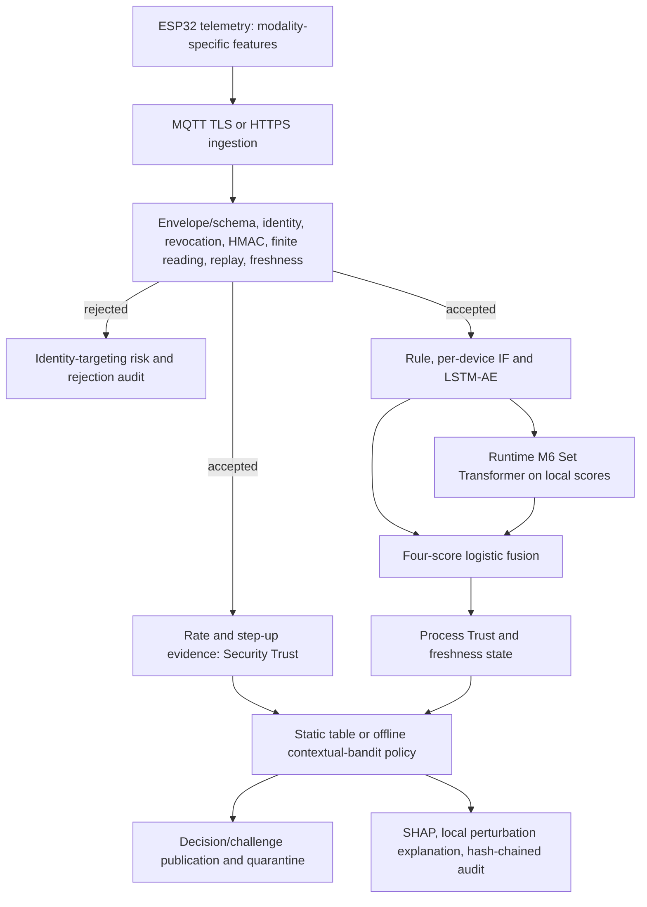

# System architecture reconstructed from implementation

[VERIFIED: code; DEPLOYMENT CANDIDATE: current checkout] The runtime paths below are implemented and exercised by tests/offline replay. This audit did not flash hardware or connect to a live broker. “Runtime” identifies the serving code; it is not evidence of a currently running deployment.

A static implementation/demonstration interface for this architecture, with no gateway
connection, is in [design/Main.dc.html](../../design/Main.dc.html) ([package README](../../design/README.md)). It is a presentation of the results below, not a separate research contribution.

## Exact boundary and computations

`gateway._process_telemetry` holds `_pipeline_lock` through accepted-message scoring and decision persistence. It computes Security Trust at `score_security_trust(device_id, is_flood, step_up_result)` and Process Trust at `fusion_engine.combine(rule, IF, LSTM, M6)`. The first computational meeting is the gateway policy branch: `adaptive_pdp.greedy_action(security_trust_score, process_trust_score)` when `USE_RL_POLICY=True`, otherwise `policy_engine.decide(security_trust_score, process_trust_score, process_status)`. Merely storing both values in the gateway or audit row is not a fusion of evidence.

Security Trust starts at 0.8, applies bounded elapsed-time decay, then EWMA weight 0.35 to an authenticated observation: normal rate 0.95; flood 0.2; step-up success adds a bounded 0.1; failure observations decrease with the failure count. Decay is `min(0.3, 0.01*max(elapsed,0))`; score is clipped to [0,1] and rounded to three decimals. Signature failures update a separate identity-targeting record. Identity/HMAC/revocation are gates, not physical model inputs. See [trust engine](../../src/trust_engine.py), `score_security_trust`, `get_security_trust` and state classes.

Process Trust is logistic `P(normal)` from four detector scores. The process-state store retains the last numerical value on silence and marks it STALE after 20 seconds; it does not drift an unresolved anomaly toward normal. Current static thresholds are 0.6/0.6. The static `process_status` argument does not change table action by itself. The bandit accepts only the two numerical scores; the watchdog and step-up overrides are separate serving behaviours.

## Verification matrix

The [master CSV](../../results/final_verification/subsystem_matrix.csv) expands the following summary into the requested 15 fields for all 24 subsystems, including separate implementation, training, deployment, artifact and paper-description columns.

Unless specified otherwise, runtime components do not train; tests are contract coverage, not measured line coverage. “Artifact absent” is a reproduction limitation, not a passing result.

| Component / purpose | Implementation: class/function | Input → output | Algorithm / training | Inference / deployment | Test or artifact | Research limitation / paper-safe description |
|---|---|---|---|---|---|---|
| Firmware / acquire and sign | `firmware/main.py`, `main_sw420.py`: feature and telemetry functions | Sensor windows → signed feature envelope | DSP; no training | MicroPython code; captures support physical use | `test_invariants.py`, raw captures | Exact flashed revision/build unknown |
| Gateway ingestion | `gateway.process_telemetry`, `on_message` | JSON envelope → decision/audit | Locked staged validation | Runtime | `test_gateway_input_validation.py` | MQTT wire operation not remeasured here |
| Identity | Registry lookup in `_process_telemetry` | Claimed ID → known/unknown | Static registry | Pre-HMAC gate | `test_invariants.py` | Claimed ID is not proof of sender |
| Authentication | `gateway.verify_signature` | Payload, signature, key → boolean | HMAC-SHA256 | Runtime gate | canonicalization and rejection tests | No hardware root of trust |
| Revocation | `trust_engine.is_revoked`, `revoke_device` | ID → rejection override | In-memory registry status | Before HMAC | invariant tests | Durable lifecycle management limited |
| HMAC / rotation | `verify_signature_with_rotation` | Current/previous key → verification | Grace-window key rotation | Runtime | invariant tests | Secret provisioning outside tracked source |
| Replay | `check_boot_replay`, `commit_boot_seq` | Boot/sequence → accept; committed baseline | Strict monotonic counters | Commit after all gates | boot-state isolation tests | Gateway replay baseline not durable across restart |
| Freshness | `check_timestamp_freshness` | Signed timestamp → boolean | Absolute 600-second window | Runtime gate | freshness/malformed tests | Demo tolerance is wide |
| Security Trust | `score_security_trust` | Authenticated rate/step-up → trust | Decay + EWMA, no learning | Runtime | separation/state tests | Does not identify every compromised-key attack |
| Physical telemetry | `_extract_reading`, `feature_names_for` | Registry modality + payload → typed reading | Exact field selection | After authentication | hardware schema tests | Semantically false but finite values can authenticate |
| Preprocessing | `feature_engineering.feature_vector`; `datasets.normal_sequences` | Named fields/runs → ordered vectors/windows | Saved TRAIN mean/std | Training/inference separated | temporal/schema tests; model metadata | Resampled network trajectories are not contiguous physical acquisitions |
| Local detectors | `rule_range_score`, `IsolationForestScorer`, `LSTMAEScorer` | Local reading/window → normality scores | Rule; offline IF and LSTM-AE | Runtime | local replay; checkpoint metadata | Scalar devices mirror rule into IF/LSTM slots |
| Temporal Transformer | `TransformerScorer` | Eight-step window → score | Offline denoising Transformer AE | Ablation only | fair local comparison | No measured deployment advantage |
| Relational runtime | `SetTransformerScorer.score`, `_SetTransformer` (gateway alias `GNNScorer`) | Per-node [rule,IF,LSTM] → P(normal) | Offline attention model; three input channels, width 16, four heads, two blocks | Configured serving; offline scenario tested | `models/set_transformer_corrected.pt` (promoted 2026-09-07; runtime verifier) | Separate from four-channel benchmark M6; trainer class-weight bug FIXED and comparative fusion/policy gain now measured (13 O4/O5) |
| Relational research | Benchmark M1–M9 factories | Constructed score snapshots → per-node probabilities | Offline sklearn/PyTorch | Experimental | crossdevice metrics | No persisted per-model M1–M9 checkpoints |
| Fusion | `FusionEngine.combine` | Rule/IF/LSTM/M6 scores → trust/confidence | Balanced logistic regression on VAL_001 | Configured serving | Active model/background match the corrected-M6 variants (13 O2/O5) | Comparative gain measured (13 O4, held-out-replay-qualified); local-only complementarity still unverified |
| Process Trust | `update_process_anomaly`, `get_process_anomaly` | Fused normality → retained score/status | State store; no training | Runtime | staleness tests | Confidence is probability decisiveness, not uncertainty calibration |
| Policy | `decide`; `AdaptivePDP.greedy_action` | Two trusts → four actions | Static table / offline sample-average bandit | Bandit selected by config | policy comparison metrics | No sequential Bellman learning |
| Explainability | `FusionEngine._explain`; `explainability.level2_explain` | Scores/models → additive log-odds and perturbation explanation | SHAP LinearExplainer; repair probes | Runtime and experimental evaluation | explanation tests/log | Repair/rank metrics differ; some use historical 0.5 |
| Audit logging | `audit_log.log_decision`, integrity/checkpoint verification | Decision → SQLite chain/checkpoints | SHA-256 chain, separate HMAC key | Runtime | audit-chain invariants | Local key/storage compromise is outside guarantee |
| Virtual generator | `VirtualDevice`, `generate_virtual_network_data.py` | TRAIN/VAL/TEST source blocks + seed → generated streams | Affine transform + covariance-aware AR(1) + drift | Offline experiment | generator tests/validation log | Single-source internal realism diagnostic |
| Benchmark generation | `generate_network_data.py` | Real pools + legacy simulator → 20-node scenarios | Seeded resampling/scenario injection | Offline | schema/generation tests; network files | Physical-source rows sampled with replacement |
| Hardware capture | `collect_hardware_session.py`, `merge_real_hardware_data.py` | Gateway records + operator marks → labelled data | Capture/curation; no learner | Operator-dependent | raw captures/split manifest | No fresh capture during audit |
| Experiment scripts | `train_*.py`, `evaluate_*.py`, benchmark | Frozen splits/checkpoints → metrics | Offline training/evaluation | Research only | preserved logs/JSON | Some scripts print rather than persist JSON |

Paths in the matrix resolve under [src](../../src), [scripts](../../scripts), [tests](../../tests) and [firmware](../../firmware). Evidence indexing and producer/command mappings are in [12](12_EXPERIMENTAL_PROTOCOL.md), [13](13_RESULTS_MASTER_TABLES.md) and [24](24_REPRODUCIBILITY_GUIDE.md).

## Runtime versus research candidate

The gateway imports `SetTransformerScorer` as `GNNScorer`; the alias and `gnn_score` audit/API field preserve compatibility. As of the 2026-09-07 corrected-M6 promotion, it loads `models/set_transformer_corrected.pt` (three local-score input channels, attention over time-active identities) — the checkpoint originally deployed by commit `3c827e8`, `models/set_transformer_runtime.pt`, had a confirmed class-weight training defect and is preserved, untouched, as historical evidence (`src/relational_pin.py`'s `M6_DEPLOYED` pin, `13 O4`). Benchmark M6 uses an additional validity input channel and separate unsaved fits; its metrics do not describe this checkpoint. Historical `models/gnn.pt` and `models/gnn_backup.pt` retain the time-coactive GCN lineage; benchmark M4 uses `models/gnn_network.pt` and declared topology. Active fusion/background match the corrected-M6 variants; GCN-fitted and originally-deployed-M6-fitted backups are all retained. M6 integration exists, and matched comparative fusion/policy gain over GCN is now measured under a held-out-replay qualifier (13 O4/O5); physical end-to-end validation remains open — see [10](10_FUSION_AND_PROCESS_TRUST.md).

Runtime registry includes the two physical identities, two legacy scalar identities and eighteen dynamically registered simulated feature nodes: 22 entries. The network benchmark uses the 20 feature-carrying entries. The legacy replay exercises three identities. Do not equate registry shape, benchmark cardinality and simultaneously connected physical devices.

## Failure and training contracts

Parsing/type validation precedes identity; identity and revocation precede HMAC; finite-reading checks precede replay and freshness; only then does `commit_boot_seq` mutate accepted state. The expected conceptual ordering has therefore been refined by code: malformed envelope fields must be checked before a registry lookup is safe. `_reject` updates targeting risk and audit records but uses a read-only trust peek; it does not update accepted sequences, model histories, Security Trust, Process Trust or quarantine counters. Logging cooldown applies only after a failed HMAC, so attackers cannot throttle authenticated traffic by claiming its ID.

Runtime scorer methods load checkpoints, set evaluation mode and use inference calls; gateway never calls fit, backward, optimizer step or bandit update. Bandit `_get_q` can initialize an unseen bucket from the static policy; this is deterministic memoization, not reward-based online training. Offline scripts use stored `auth_ok`/event annotations rather than cryptographically revalidating historical captures. The no-training-on-rejection property is established for runtime and declared offline filters, not arbitrary maliciously edited dataset files.

Model-file absence can activate neutral score or mean-fusion fallbacks. Startup rejects unconfigured MQTT TLS/broker credentials but does not require every learned checkpoint. This is a deployment limitation: serving availability is not proof that the complete trained chain is loaded. See [03](03_THREAT_MODEL_AND_ZERO_TRUST_DESIGN.md) and [10](10_FUSION_AND_PROCESS_TRUST.md).

## Final architecture verification gate

| Required question | Verified answer and limit |
|---|---|
| 1. Where does Security Trust originate? | `score_security_trust`: authenticated rate/step-up evidence, decay and EWMA; initialized at 0.8. |
| 2. Where does Process Trust originate? | `FusionEngine.combine`: logistic normality from rule, IF, LSTM and configured runtime M6. |
| 3. Where do they first meet? | Gateway policy call to `greedy_action(sec, proc)` or static `decide(sec, proc, status)`. |
| 4. Can a security failure contaminate process-model training? | No runtime fitting occurs. Offline scripts use curated authentication/event annotations; arbitrary malicious dataset edits are outside this guarantee. |
| 5. Can process inference bypass authentication? | Not through the inspected telemetry entry point; its gates precede model/state updates. Offline evaluators intentionally replay stored records. |
| 6. Can rejected traffic mutate trust state? | Tested rejections leave accepted trust/history unchanged. Separate targeting/audit records change; expired previous-key cleanup is a registry-metadata exception. |
| 7. Does live inference train? | No fit/backward/optimizer/bandit reward update on the gateway path. Static initialization of unseen policy buckets is memoization. |
| 8. Are local features correct per sensor? | Five MPU and four SW channels, with device-specific ordering and saved dimensions. This does not establish SW held-out accuracy. |
| 9. Are pending nodes structurally excluded? | Tested benchmark paths and runtime inactive-score construction canonicalize invalid values before arithmetic. M6 serving uses `np.where` and attention masks. The class-weight bug that counted invalid labels (7.2x suspicious-class overweight) is FIXED and the fix is now deployed (`set_transformer_corrected.pt`, 13 O4/O5) — do not extend this fix to any other benchmark training guarantee not separately verified. |
| 10. Is M6 live? | Yes, the corrected checkpoint is deployed as of the 2026-09-07 promotion, confirmed by direct gateway-module introspection (`results/m6_corrected_policy/runtime_verification.json`), and exercised in offline scenarios. No physical live deployment was observed in this audit. |
| 11. Which relational model does runtime use? | `SetTransformerScorer` and `models/set_transformer_corrected.pt` (promoted 2026-09-07); the `GNNScorer` alias is a legacy identifier. The originally-deployed `set_transformer_runtime.pt` is preserved as historical evidence, not loaded. |
| 12. Is fusion trained with the selected relational candidate? | Yes: active model/background are byte-identical to the corrected-M6-fitted variants (13 O2/O5). Comparative gain over GCN is now measured under a held-out-replay qualifier (13 O4), not just artifact selection. |
| 13. Does final policy consume current fused output? | The gateway calls the configured policy with the fused Process Trust score and separate Security Trust; current config selects the offline bandit. Saved policy experiment metrics are a separate replay lineage. |
| 14. What hardware is physically evidenced? | Captures from one MPU6050 and one SW-420; held-out physical replay exists only for MPU. No fresh flashing or broker session was performed here. |
| 15. What is generated in the 20-node experiment? | Eighteen simulated identities; the two physical-source columns are constructed by split-respecting resampling. Missing SW held-out data remains pending. |
| 16. Strongest verified end-to-end result? | Offline replay of the implemented fusion scoring chain on held-out MPU captures: 30/30 disturbances and 5/12 resting false alarms after exclusions, identical across GCN, originally-deployed M6 and corrected M6 (13 O4/O5, `results/m6_corrected_policy/hardware_regression.json`). This is not complete sensor-to-policy-enforcement validation. |
| 17. Which architectural component still needs validation? | RESOLVED as of 2026-09-07 (13 O4/O5): correctly pinned M6 comparisons (`src/relational_pin.py`), valid-only training weights (deployed), replay-clock alignment (deterministic clock, opt-in), matched policy provenance (`relational_pin.verify_policy_lineage()`). Still open: physical SW-420 held-out performance, firmware peer verification, acquisition-to-enforcement latency. |
